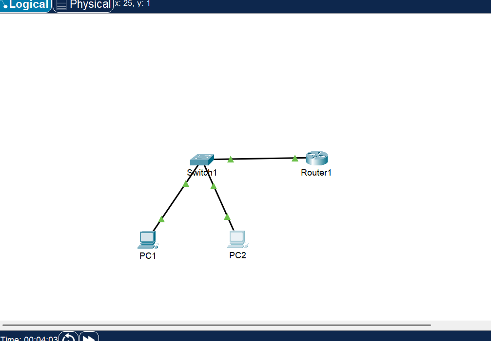

# CCNA Lab - Week 1 Day 1

## Objective

Build a simple LAN using Cisco Packet Tracer.

## Description

This lab demonstrates how to build a simple Local Area Network (LAN) and verify connectivity between two PCs.

## Devices

- 1 Router
- 1 Switch
- 2 PCs

## Configuration

### PC1

- IP Address: 192.168.1.10
- Subnet Mask: 255.255.255.0

### PC2

- IP Address: 192.168.1.20
- Subnet Mask: 255.255.255.0

## Connectivity Test

✅ Ping between PC1 and PC2: Successful

## Skills Learned

- Network Topology
- Switch Connections
- IP Address Configuration
- Ping
- Basic LAN Configuration

## Technologies

- Cisco Packet Tracer
- IPv4
- LAN
- ICMP

## Topology

