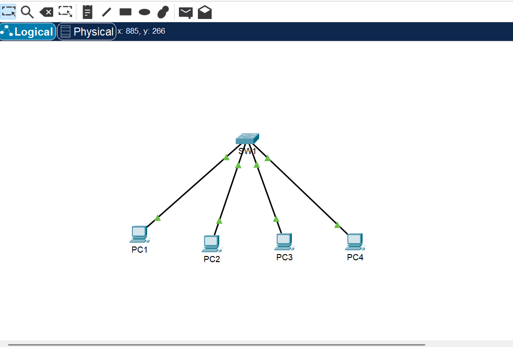

# CCNA Lab - Week 1 Day 2

## Objective

Configure IPv4 addressing manually on end devices and verify network connectivity.

## Description

This lab demonstrates how to manually configure IPv4 addresses on multiple PCs connected to a switch and verify successful communication using the Ping command.

## Devices

- 1 Switch (SW1)
- 4 PCs

## Configuration

### PC1

- IP Address: 192.168.1.10
- Subnet Mask: 255.255.255.0

### PC2

- IP Address: 192.168.1.20
- Subnet Mask: 255.255.255.0

### PC3

- IP Address: 192.168.1.30
- Subnet Mask: 255.255.255.0

### PC4

- IP Address: 192.168.1.40
- Subnet Mask: 255.255.255.0

> **Note:** No Default Gateway was configured because all PCs are connected to the same LAN and there is no router in this lab.

## Connectivity Test

✅ Ping between all PCs: Successful

## Skills Learned

- IPv4 Address Configuration
- Subnet Mask
- Static IP Configuration
- Basic LAN Connectivity
- Ping Command
- Network Troubleshooting

## Technologies

- Cisco Packet Tracer
- IPv4
- LAN
- ICMP

## Topology

