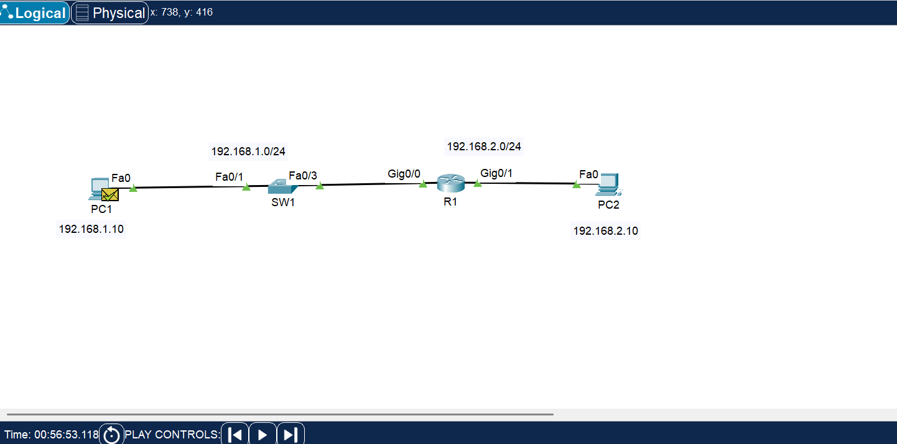
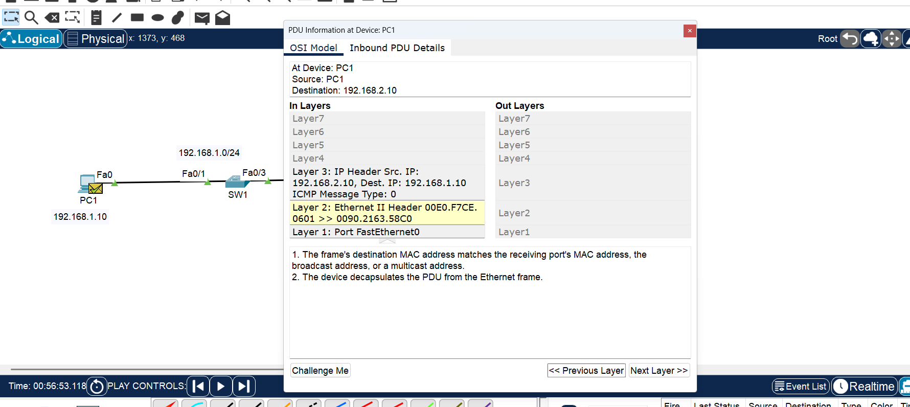
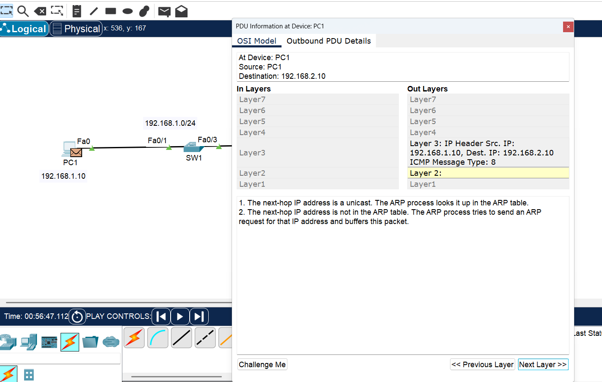

# Day 03 - OSI, ARP and Routing

## Objective
شرح مختصر لهدف اللاب...

## Network Topology

## IP Addressing

| Device | IP Address | Gateway |
|---|---|---|
| PC1 | 192.168.1.10 | 192.168.1.1 |
| R1 G0/0 | 192.168.1.1 | - |
| R1 G0/1 | 192.168.2.1 | - |
| PC2 | 192.168.2.10 | 192.168.2.1 |

## Router Configuration

الأوامر المستخدمة...

## OSI / Packet Simulation

## ARP

شرح مختصر لما حدث مع ARP...

## ICMP

- Type 8 = Echo Request
- Type 0 = Echo Reply

## What I Learned

- I learned how to analyze network packets using the OSI model.
- I learned how ARP maps IP addresses to MAC addresses.
- I learned how ICMP works with Ping.
- I learned the difference between IP and MAC addresses.
- I observed how MAC addresses change when traffic passes through a router.
- I practiced using Packet Tracer Simulation Mode and basic Cisco IOS commands.

## Packet Tracer File

`Day-03-OSI-ARP-Routing.pkt`