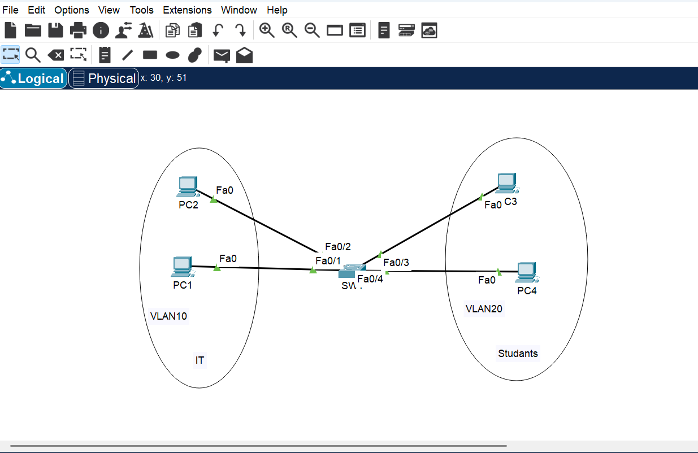
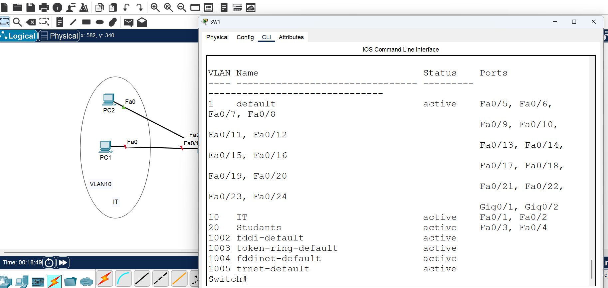
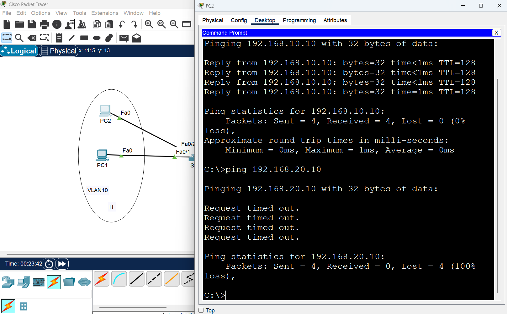
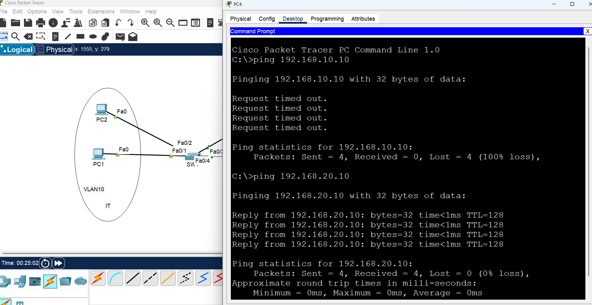

# Day 04 - VLANs

## Objective

The objective of this lab is to understand VLANs and how they are used to logically separate devices within a switched network.

## Network Topology

The network contains two VLANs:

- VLAN 10 - IT
- VLAN 20 - Students

## VLAN Configuration

The switch was configured with two VLANs:

| VLAN | Name | Ports |
|------|------|-------|
| 10 | IT | Fa0/1, Fa0/2 |
| 20 | Students | Fa0/3, Fa0/4 |

## IP Addressing

| Device | VLAN | IP Address |
|--------|------|------------|
| PC1 | 10 | 192.168.10.10/24 |
| PC2 | 10 | 192.168.10.20/24 |
| PC3 | 20 | 192.168.20.10/24 |
| PC4 | 20 | 192.168.20.20/24 |

## Connectivity Testing

Devices within the same VLAN can communicate successfully.

- PC2 → PC1: Successful
- PC4 → PC3: Successful
- Packet loss: 0%

Communication between different VLANs is not possible because no Layer 3 device is configured for Inter-VLAN Routing.

- PC2 → PC3: Failed
- Packet loss: 100%

## What I Learned

- VLANs can logically separate devices within the same physical switch.
- Devices in the same VLAN can communicate directly at Layer 2.
- Devices in different VLANs require a Layer 3 device for communication.
- VLAN assignment is based on switch ports.
- `show vlan brief` can be used to verify VLAN configuration and port membership.
- Ping testing can be used to verify connectivity within and between VLANs.

## Packet Tracer File

[Download the Packet Tracer file](Day-04-VLANs.pkt)