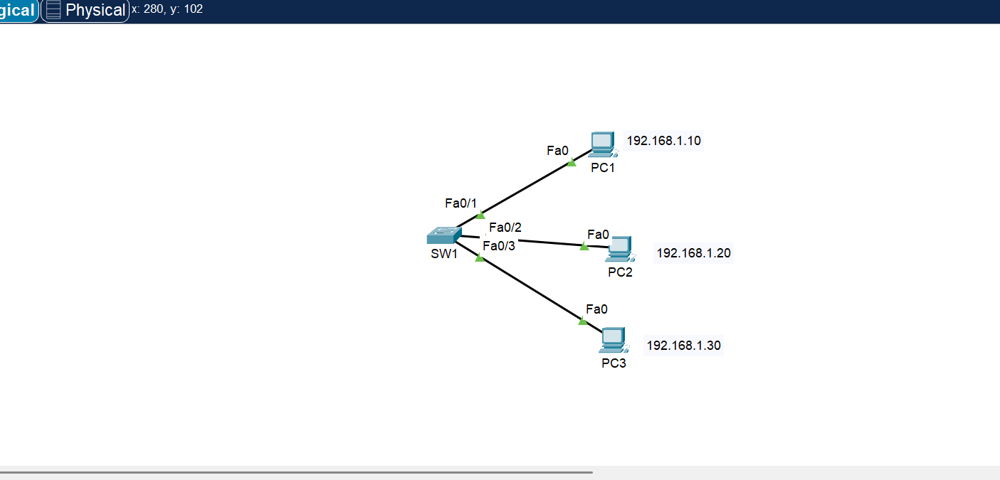
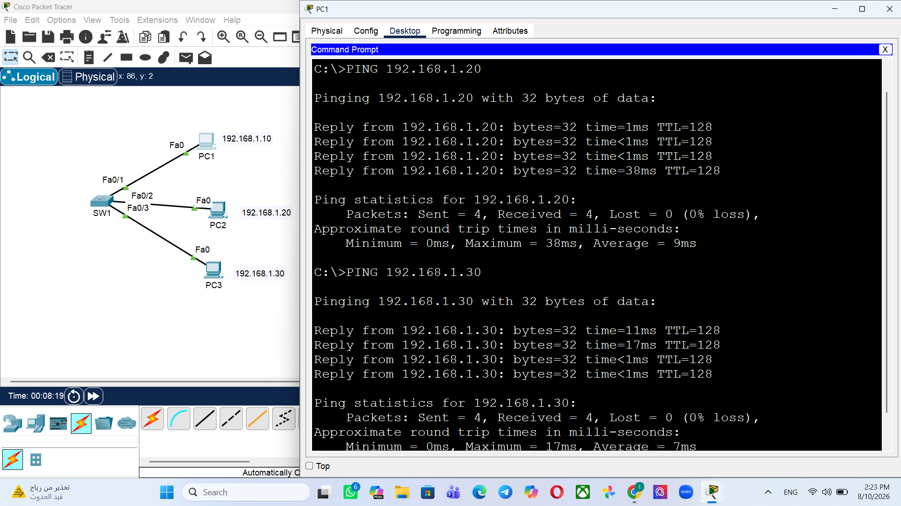
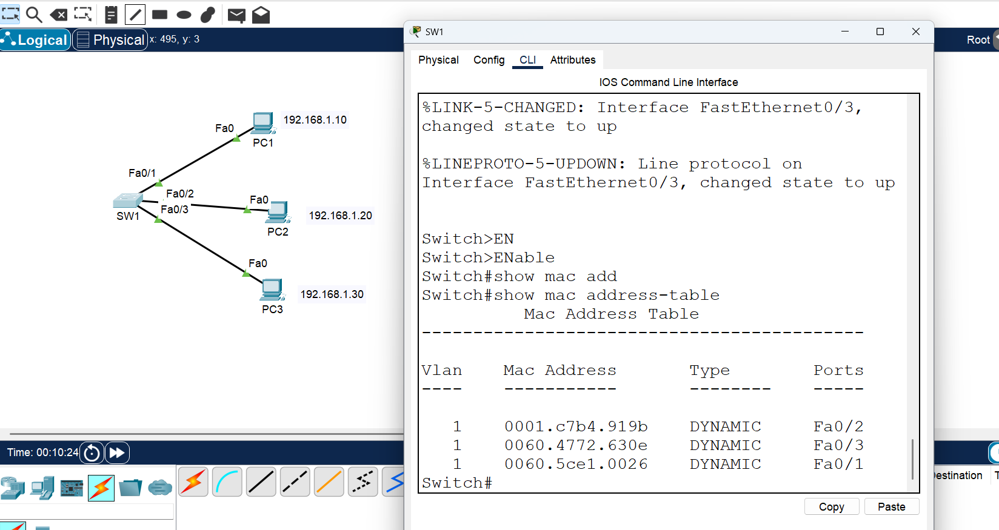
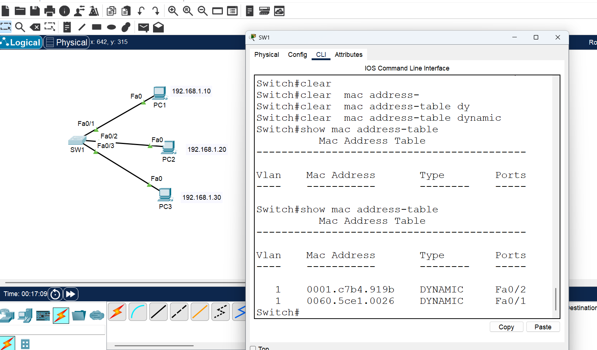

# Day 05 - Ethernet LAN

## Objective

Understand basic Ethernet LAN communication and how a switch learns MAC addresses.

## Topology

- PC1: `192.168.1.10` → `Fa0/1`
- PC2: `192.168.1.20` → `Fa0/2`
- PC3: `192.168.1.30` → `Fa0/3`



## Connectivity Test

PC1 successfully pinged PC2 and PC3 with **0% packet loss**.



## MAC Address Table

The switch dynamically learns MAC addresses using:

```text
show mac address-table
```

Dynamic MAC addresses were observed on `Fa0/1`, `Fa0/2`, and `Fa0/3`.

(mac-address-table2.png)



## Key Concepts

- Ethernet LAN
- MAC addresses
- MAC address learning
- MAC address table
- Frame forwarding

## Files

- `Day-05-Ethernet-LAN.pkt`
- `topology.png`
- `mac-address-table.png`
- `connectivity-testing.png`